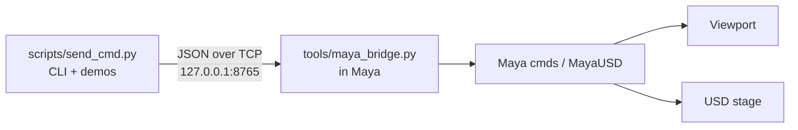

# OpenUSD Live Control

Real-time Maya / USD scene control from the command line. A small socket bridge runs inside Maya; `send_cmd.py` sends JSON commands and the viewport updates instantly.

## Quick start

**Requirements:** Maya 2026 (or compatible), MayaUSD, Windows 10/11.

**1. Launch Maya** (from this repo):

```batch
scripts\run_maya.bat
```

**2. Load the bridge** in Maya Script Editor (Python tab):

```python
exec(open(r'C:\path\to\openusd-live-control\tools\maya_bridge.py').read())
```

You should see `Listening on 127.0.0.1:8765`.

**3. Send commands** from a terminal (use your clone path):

```batch
cd C:\path\to\openusd-live-control
call scripts\env_maya.bat
python scripts\send_cmd.py add_cube /World/Box 2
python scripts\send_cmd.py set_color Box red
```

Full walkthrough: [00_START_HERE.md](00_START_HERE.md)

## Architecture



## Features

- Create and transform objects programmatically
- Live color / material changes without manual refresh
- Load USD assets and drive individual components
- Import FBX characters and drive animation
- Dynamic camera posing
- Typical round-trip under ~50ms on localhost

## Common commands

```batch
python scripts\send_cmd.py add_cube /World/Box 2
python scripts\send_cmd.py set_pose Box 5 0 0 0 90 0
python scripts\send_cmd.py set_color Box yellow
python scripts\send_cmd.py set_camera persp 10 10 10 -30 30 0
python scripts\send_cmd.py list_objects
```

See [02_COMMANDS.md](02_COMMANDS.md) for the full list.

## Demo scripts

```batch
python scripts\test_complete_system.py
python scripts\box_color_change.py
python scripts\warehouse_box_scanner.py
python scripts\character_kitchen_walk.py
```

## Documentation

| File | Purpose |
|------|---------|
| [00_START_HERE.md](00_START_HERE.md) | First-time setup |
| [01_COMPLETE_GUIDE.md](01_COMPLETE_GUIDE.md) | Full system docs |
| [02_COMMANDS.md](02_COMMANDS.md) | Command reference |
| [03_TROUBLESHOOTING.md](03_TROUBLESHOOTING.md) | Common fixes |
| [04_WAREHOUSE_PROJECT.md](04_WAREHOUSE_PROJECT.md) | Warehouse USD control |
| [05_CHARACTER_ANIMATION.md](05_CHARACTER_ANIMATION.md) | Character animation |

## Layout

```
scripts/     CLI, env helpers, demos
tools/       Maya bridge (runs inside Maya)
scenes/      USD assets
plugins/     Optional plugin helpers
```

## Verify it works

- Bridge logs: `Listening on 127.0.0.1:8765`
- `list_objects` returns JSON with `"ok": true`
- `add_cube` creates a visible box; `set_color` changes it in the viewport
